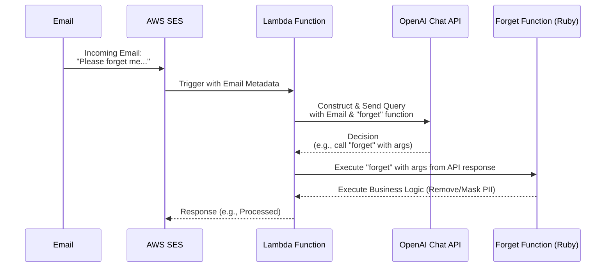

# 'Forget Me' AI data entry agent

A serverless AI-powered data entry system for handling unstructured 'please forget me' GDPR request emails.

## Overview

In the era of data privacy regulations such as GDPR and CCPA, businesses are obligated to honor requests from individuals to delete or mask their personal data. These "forget-me" or "right to erasure" requests can be numerous and varied in format, making manual processing tedious and prone to errors. This repository offers an automated solution to this challenge, leveraging AWS services and OpenAI's Chat API.

The primary goal is to detect and act upon valid "forget-me" requests sent to a designated contact email address, ensuring timely and accurate compliance while reducing the operational overhead.

## Serverless

This component is built entirely with serverless AWS technology,

## How It Works

1. **Email Reception**: An email is received by **AWS SES**.
2. **Lambda Activation**: SES triggers a **Lambda function** with the email data.
3. **OpenAI Query**: The Lambda constructs a query, including a "forget" function, and sends it to **OpenAI's Chat API**.
4. **Decision Making**: OpenAI determines if the email is a valid "forget-me" request and, if so, how to call the "forget" function.
5. **Data Processing**: Based on OpenAI's decision, the Lambda executes the "forget" function, which handles the necessary data masking or removal. (Out of scope of this example project.)
6. **Response**: Lambda could send a completion status back to SES. (It doesn't do this yet.)

For a visual representation of this process, see the sequence diagram below:

By automating the detection and processing of "forget-me" requests, this system aids businesses in maintaining compliance with data privacy regulations, ensuring a more efficient and error-free approach.

## Example

You might be getting a lot of emails like this lately from privacy apps and services:

> To: contact@yourdomain.com
> Subject: Data erasure request
> 
> Dear Privacy Team,
> 
> I’m asking several companies to delete the data they hold on me. To make this easy for me to manage, and in line with the ICO guidance, please don’t ask me to perform a self service process or fill out a form.
> 
> I would like to exercise my right of erasure under data protection law. If there’s any information that can’t be deleted for regulatory reasons please confirm what needs to be retained and minimise what you can. (Eg. Marketing and third party data processing).
> 
> To help find my account in your records, my details are:
> 
> Name: Jane Doe
> Email: janedoe@example.com
> 
> Please send email confirmation once the process has been completed and if you need any more information, please let me know.
> 
> Thank you in advance.

The Lambda function that processes the email will send a request like this to the OpenAI chat API:

    {
      "model": "gpt-3.5-turbo-0613",
      "messages": [
        {
          "role": "system",
          "content": "You are a virtual assistant tasked with identifying and processing 'forget-me' requests from emails. Determine if the email content contains such a request and if so, call the 'forget' function with the appropriate arguments."
        },
        {
          "role": "user",
          "content": "Subject: Forget Me Request\n\nDear Privacy Team,\nI’m asking several companies to delete the data they hold on me. To make this easy for me to manage, and in line with the ICO guidance, please don’t ask me to perform a self service process or fill out a form.\nI would like to exercise my right of erasure under data protection law. If there’s any information that can’t be deleted for regulatory reasons please confirm what needs to be retained and minimise what you can. (Eg. Marketing and third party data processing).\nTo help find my account in your records, my details are:\nName: Jane Doe\nEmail: janedoe@example.com\nPlease send email confirmation once the process has been completed and if you need any more information, please let me know.\nThank you in advance.\n"
        }
      ],
      "functions": [
        {
          "name": "forget",
          "description": "Forget the user's data",
          "parameters": {
            "type": "object",
            "properties": {
              "email": {
                "type": "string",
                "description": "User's email address"
              },
              "phone": {
                "type": "string",
                "description": "User's phone number"
              }
            }
          }
        }
      ],
      "temperature": 0.2,
      "top_p": 0.5,
      "max_tokens": 150,
      "frequency_penalty": 0.5,
      "presence_penalty": 0.0,
      "n": 3
    }

Here's an example response:

    {
      "id": "chatcmpl-7qRb0M1igeOhq8s7ZJQyqzmg82FKH",
      "object": "chat.completion",
      "created": 1692733490,
      "model": "gpt-3.5-turbo-0613",
      "choices": [
        {
          "index": 0,
          "message": {
            "role": "assistant",
            "content": null,
            "function_call": {
              "name": "forget",
              "arguments": "{\n  \"email\": \"janedoe@example.com\"\n}"
            }
          },
          "finish_reason": "function_call"
        },
        {
          "index": 1,
          "message": {
            "role": "assistant",
            "content": null,
            "function_call": {
              "name": "forget",
              "arguments": "{\n  \"email\": \"janedoe@example.com\"\n}"
            }
          },
          "finish_reason": "function_call"
        },
        {
          "index": 2,
          "message": {
            "role": "assistant",
            "content": null,
            "function_call": {
              "name": "forget",
              "arguments": "{\n  \"email\": \"janedoe@example.com\"\n}"
            }
          },
          "finish_reason": "function_call"
        }
      ],
      "usage": {
        "prompt_tokens": 266,
        "completion_tokens": 57,
        "total_tokens": 323
      }
    }

We request three completions from the model.  We have `temperature` and `top_p` set to make the completions less creative and more deterministic.

We check to see if any of the completions call the function, and we use the first one if so.  This is defense against the model intermittently failing to call the function.

## What to do next?

You could simply implement your data deletion/masking logic directly in the Lambda function.

Our plan is to post a message to an SQS queue for pending `forget` operations.  We're going to use a Thor CLI to pull pending operations from the queue and show the details to an operator so that there's a human approval step.  We don't want to let autocannons loose on our data warehouse until we're confident that they're accurate.

Then, the next stage will be to factor out the PII deletion/masking logic from the CLI and add it to a new Lambda function that will automate the processing.

## Don't forget to notify the requestor

This project doesn't send any responses to the requestor.  Yet.

## Serverless

"This component utilizes AWS's serverless technology, offering:

- **Reliability**: Automatic failovers ensure built-in fault tolerance.
- **Efficiency**: Absence of server management reduces operational overhead.
- **Security**: Automated OS patches and granular access controls enhance security.
- **Performance**: Auto-scaling with each request and potential for multi-region deployment.

At our organization, we don't like to run mission-critical ITSM components on servers that we're responsible for managing ourselves.  We don't want to think about servers.  We only want to think about our code.

## Deploying to AWS with AWS CDK

This is a TypeScript CDK project.

The `cdk.json` file tells the CDK Toolkit how to execute your app.

### Useful commands

* `npm run build`   compile typescript to js
* `npm run watch`   watch for changes and compile
* `npm run test`    perform the jest unit tests
* `cdk deploy`      deploy this stack to your default AWS account/region
* `cdk diff`        compare deployed stack with current state
* `cdk synth`       emits the synthesized CloudFormation template
