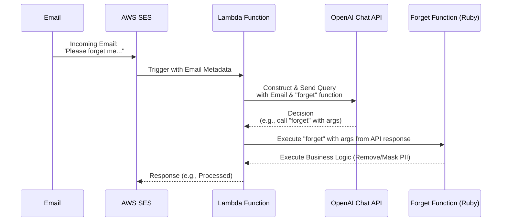

# 'Forget Me' AI data entry agent

A serverless AI-powered data entry system for handling unstructured 'please forget me' GDPR request emails.

## Overview

In the era of data privacy regulations such as GDPR and CCPA, businesses are obligated to honor requests from individuals to delete or mask their personal data. These "forget-me" or "right to erasure" requests can be numerous and varied in format, making manual processing tedious and prone to errors. This repository offers an automated solution to this challenge, leveraging AWS services and OpenAI's Chat API.

The primary goal is to detect and act upon valid "forget-me" requests sent to a designated contact email address, ensuring timely and accurate compliance while reducing the operational overhead.

## Serverless

This component is built entirely with serverless AWS technology,

## How It Works

1. **Email Reception**: An email is received by **AWS SES**.
2. **Lambda Activation**: SES triggers a **Lambda function** with the email data.
3. **OpenAI Query**: The Lambda constructs a query, including a "forget" function, and sends it to **OpenAI's Chat API**.
4. **Decision Making**: OpenAI determines if the email is a valid "forget-me" request and, if so, how to call the "forget" function.
5. **Data Processing**: Based on OpenAI's decision, the Lambda executes the "forget" function, which handles the necessary data masking or removal. (Out of scope of this example project.)
6. **Response**: Lambda could send a completion status back to SES. (It doesn't do this yet.)

For a visual representation of this process, see the sequence diagram below:

By automating the detection and processing of "forget-me" requests, this system aids businesses in maintaining compliance with data privacy regulations, ensuring a more efficient and error-free approach.

## Serverless

"This component utilizes AWS's serverless technology, offering:

- **Reliability**: Automatic failovers ensure built-in fault tolerance.
- **Efficiency**: Absence of server management reduces operational overhead.
- **Security**: Automated OS patches and granular access controls enhance security.
- **Performance**: Auto-scaling with each request and potential for multi-region deployment.

At our organization, we don't like to run mission-critical ITSM components on servers that we're responsible for managing ourselves.  We don't want to think about servers.  We only want to think about our code.

## Deploying to AWS with AWS CDK

This is a TypeScript CDK project.

The `cdk.json` file tells the CDK Toolkit how to execute your app.

### Useful commands

* `npm run build`   compile typescript to js
* `npm run watch`   watch for changes and compile
* `npm run test`    perform the jest unit tests
* `cdk deploy`      deploy this stack to your default AWS account/region
* `cdk diff`        compare deployed stack with current state
* `cdk synth`       emits the synthesized CloudFormation template
